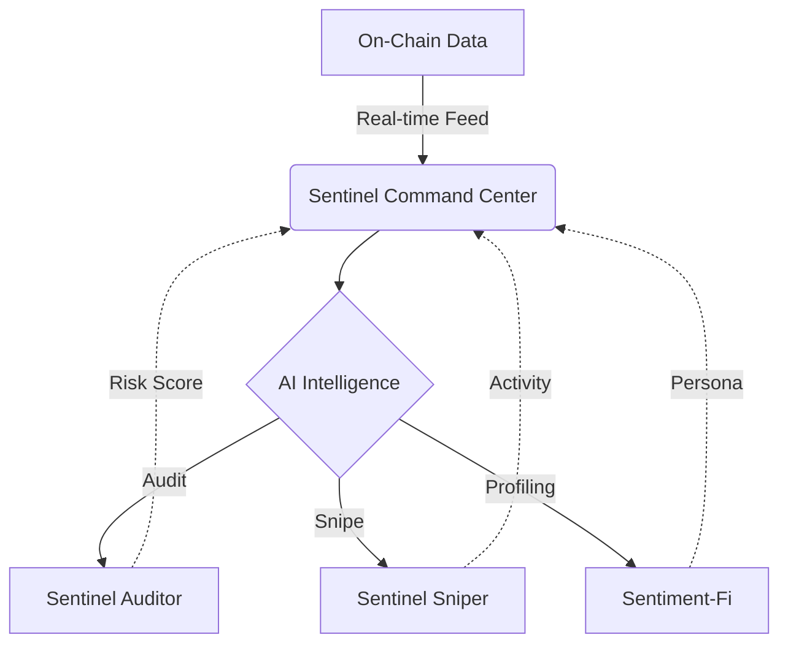
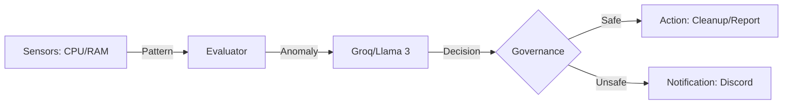

# Hi, I'm Krisna Maulana Rahman 👋
### Full-Stack AI Engineer & Web3 Researcher | Building Autonomous Intelligence

I am a developer based in Indonesia 🇮🇩 dedicated to building the next generation of autonomous systems. My work focuses on the intersection of **Blockchain Infrastructure**, **AI Agents**, and **System Security**. I don't just write code; I build "digital organisms" that monitor, analyze, and protect.

---

## 🛰️ The Sentinel Ecosystem
*An integrated intelligence platform for Decentralized Protocols and Systems.*



### 🟣 [Sentinel Command Center](https://www.google.com/search?q=https://github.com/krsnmlna1/sentinel-dashboard)

**The Hub for On-Chain Intelligence**

* **Unified Interface:** A SaaS-ready dashboard integrating security audits, market sentiment, and whale activity.
* **Real-Time Surveillance:** Multi-chain volatility analysis and anomaly detection feed.
* **Tech:** Next.js, Tailwind CSS, Ethers.js, WebSocket.

### 🛡️ [Sentinel Auditor](https://www.google.com/search?q=https://github.com/krsnmlna1/sentinel-auditor)

**AI-Powered Smart Contract Security**

* **The Core:** Uses LLMs (OpenAI/DeepSeek) to detect critical vulnerabilities like Reentrancy and Overflow in Solidity.
* **Automated Research:** Translates complex code logic into human-readable security reports.

### 🔫 [Sentinel Sniper](https://www.google.com/search?q=https://github.com/krsnmlna1/sentinel-sniper)

**High-Frequency DeFi Automation**

* **Performance:** Mempool monitoring with <100ms latency for token listing detection via Alchemy WSS.

---

## 🖥️ System Intelligence: Sentinel-OS

*Autonomous System Monitoring & Protection Agent.*



### 🛡️ [Digital Agent Ecosystem (Sentinel-OS)](https://www.google.com/search?q=https://github.com/krsnmlna1/Digital-Agent-Ecosystem)

**An AI-Powered, Multi-Agent System for OS Protection**

* **Self-Aware Monitoring:** A swarm of agents (RAM Guardian, Disk Sentinel) that watches CPU, RAM, and Network.
* **Cognitive Logic:** Uses Groq/Llama 3 to interpret system patterns and predict issues (e.g., "Disk full in 4 days").
* **Safety First:** Governance-driven actions that prioritize system stability and user trust.
* **Tech:** Python, Docker, Groq API, Event-Driven Architecture.

---

## 🛠 Tech Stack

* **AI/Agents:** Groq API, OpenAI API, DeepSeek, LangChain, Node.js Agents.
* **Blockchain:** Solidity, Ethers.js, Web3.js, Hardhat, Alchemy/Infura, IPFS.
* **Frontend/Backend:** Next.js, React, Node.js, Express.js, TypeScript, Python.
* **Database/Cloud:** PostgreSQL, MongoDB, Docker, Linux (Remote Ops ready).

---

## 🧪 Other Research & Proof of Work

* **Sentiment-Fi:** AI-powered on-chain persona engine analyzing transaction history.
* **MCP Implementations:** Building Model Context Protocol tools for AI-Blockchain integration.
* **LDPE Pyrolysis Optimization:** Data-driven research on plastic waste-to-energy conversion.

## 📫 Let's Build Something Together

* **LinkedIn:** [Krisna Maulana](https://www.google.com/search?q=https://linkedin.com/in/krsnmlna)
* **Twitter/X:** [@krsnmlna_1](https://www.google.com/search?q=https://x.com/krsnmlna_1)
* **Portfolio:** [Sentinel Dashboard](https://www.google.com/search?q=http://localhost:3000)

---

*"The best way to predict the future is to build it."*

```
